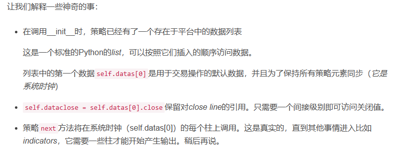
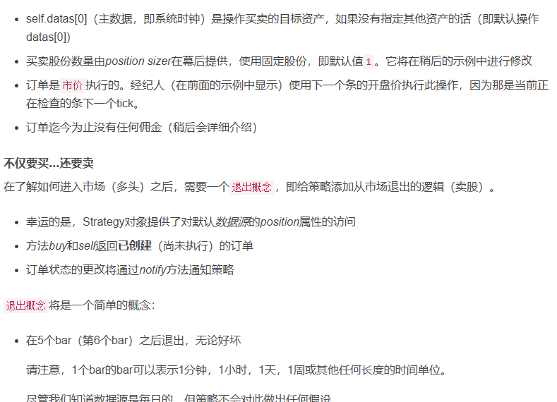
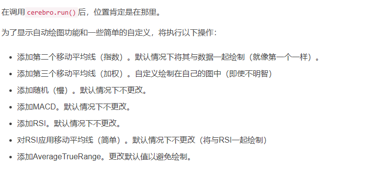

# BackTrader
是一个基于python的回测框架，用于在研究后实盘策略中的效果测试
https://blog.csdn.net/windanchaos/article/details/131870182
## 基本设置
### 设置现金，开一个实例回测
```python

    from __future__ import (absolute_import, division, print_function,
                        unicode_literals)

    import backtrader as bt

    if __name__ == '__main__':
        cerebro = bt.Cerebro()
        cerebro.broker.setcash(100000.0)

        print('Starting Portfolio Value: %.2f' % cerebro.broker.getvalue())

        cerebro.run()

        print('Final Portfolio Value: %.2f' % cerebro.broker.getvalue())
``````

### 添加回测的数据源
```python
from __future__ import (absolute_import, division, print_function,
                        unicode_literals)

import datetime  # 用于日期时间对象
import os.path  # 用于管理路径
import sys  # 用于查找脚本名称（在argv [0]中）

# 导入backtrader平台
import backtrader as bt

if __name__ == '__main__':
    # 创建cerebro实体
    cerebro = bt.Cerebro()

    # 数据在样本的子文件夹中。需要找到脚本所在的位置
    # 因为它可以从任何地方调用
    modpath = os.path.dirname(os.path.abspath(sys.argv[0]))
    datapath = os.path.join(modpath, '../datas/orcl-1995-2014.txt')

    # 创建数据源
    data = bt.feeds.YahooFinanceCSVData(
        dataname=datapath,
        # 不传递此日期之前的值
        fromdate=datetime.datetime(2000, 1, 1),
        # 不传递此日期之后的值
        todate=datetime.datetime(2000, 12, 31),
        reverse=False)

    # 将数据源添加到Cerebro
    cerebro.adddata(data)

    # 设置我们所需的现金起始值
    cerebro.broker.setcash(100000.0)

    # 打印出起始条件
    print('起始投资组合价值：%.2f' % cerebro.broker.getvalue())

    # 运行所有
    cerebro.run()

    # 打印出最终结果
    print('最终投资组合价值：%.2f' % cerebro.broker.getvalue())

```
```
## 第一个策略的雏形
```python
# 导入所需模块
from __future__ import (absolute_import, division, print_function, unicode_literals)
import datetime  # 日期时间模块
import os.path  # 路径模块
import sys  # 系统模块

# 导入backtrader平台
import backtrader as bt

# 创建策略
class TestStrategy(bt.Strategy):

    def log(self, txt, dt=None):
        ''' 日志函数 '''
        dt = dt or self.datas[0].datetime.date(0)
        print('%s, %s' % (dt.isoformat(), txt))

    def __init__(self):
        # 保留对数据序列中`close`线的引用
        self.dataclose = self.datas[0].close

    def next(self):
        # 记录数据序列的收盘价
        self.log('收盘价, %.2f' % self.dataclose[0])

if __name__ == '__main__':
    # 创建cerebro实体
    cerebro = bt.Cerebro()

    # 添加策略
    cerebro.addstrategy(TestStrategy)

    # 数据在样本的子文件夹中。需要找到脚本所在的位置，因为它可以从任何地方调用
    modpath = os.path.dirname(os.path.abspath(sys.argv[0]))
    datapath = os.path.join(modpath, '../datas/orcl-1995-2014.txt')

    # 创建数据源
    data = bt.feeds.YahooFinanceCSVData(
        dataname=datapath,
        # 不传递此日期之前的值
        fromdate=datetime.datetime(2000, 1, 1),
        # 不传递此日期之前的值
        todate=datetime.datetime(2000, 12, 31),
        reverse=False)

    # 将数据源添加到Cerebro
    cerebro.adddata(data)

    # 设置初始资金
    cerebro.broker.setcash(100000.0)

    # 打印初始条件
    print('初始资产价值: %.2f' % cerebro.broker.getvalue())

    # 运行策略
    cerebro.run()

    # 打印最终结果
    print('最终资产价值: %.2f' % cerebro.broker.getvalue())


```

输出的结果：

    初始资产价值: 100000.00
    2000-01-03, 收盘价, 26.27
    2000-01-04, 收盘价, 23.95
    ...
    ...
    ...
    2000-12-28, 收盘价, 27.63
    2000-12-29, 收盘价, 25.85
    最终资产价值: 100000.00




### 设置一个策略执行，如果个股连跌3天就买入

```python

from __future__ import (absolute_import, division, print_function,
                        unicode_literals)

import datetime  # 导入日期时间库
import os.path  # 导入路径管理库
import sys  # 导入系统库

# 导入backtrader平台
import backtrader as bt


# 创建策略
class TestStrategy(bt.Strategy):

    def log(self, txt, dt=None):
        ''' 日志记录函数'''
        dt = dt or self.datas[0].datetime.date(0)
        print('%s, %s' % (dt.isoformat(), txt))

    def __init__(self):
        # 保留对数据序列中`close`线的引用
        self.dataclose = self.datas[0].close

    def next(self):
        # 记录数据序列的收盘价
        self.log('Close, %.2f' % self.dataclose[0])

        if self.dataclose[0] < self.dataclose[-1]:
            # 当前收盘价小于前一个收盘价

            if self.dataclose[-1] < self.dataclose[-2]:
                # 前一个收盘价小于前一个收盘价

                # 买入
                self.log('BUY CREATE, %.2f' % self.dataclose[0])
                self.buy()


if __name__ == '__main__':
    # 创建cerebro实体
    cerebro = bt.Cerebro()

    # 添加策略
    cerebro.addstrategy(TestStrategy)

    # 数据在样本的子文件夹中。需要找到脚本所在的位置
    # 因为它可以从任何地方调用
    modpath = os.path.dirname(os.path.abspath(sys.argv[0]))
    datapath = os.path.join(modpath, '../datas/orcl-1995-2014.txt')

    # 创建数据源
    data = bt.feeds.YahooFinanceCSVData(
        dataname=datapath,
        # 不要传递此日期之前的值
        fromdate=datetime.datetime(2000, 1, 1),
        # 不要传递此日期之前的值
        todate=datetime.datetime(2000, 12, 31),
        # 不要传递此日期之后的值
        reverse=False)

    # 将数据源添加到Cerebro
    cerebro.adddata(data)

    # 设置我们的期望现金起始值
    cerebro.broker.setcash(100000.0)

    # 打印出起始条件
    print('Starting Portfolio Value: %.2f' % cerebro.broker.getvalue())

    # 运行策略
    cerebro.run()

    # 打印出最终结果
    print('Final Portfolio Value: %.2f' % cerebro.broker.getvalue())
```

### 创建一个策略，实现目标，如果连跌3日就买入，如果持仓了，过了5日就卖出
self.datas[0]是主数据，是操作买卖的目标资产，如果没有其它指定资产



```python
from __future__ import (absolute_import, division, print_function,
                        unicode_literals)

import datetime  # 导入datetime模块
import os.path  # 导入os.path模块
import sys  # 导入sys模块

# 导入backtrader平台
import backtrader as bt


# 创建策略
class TestStrategy(bt.Strategy):

    def log(self, txt, dt=None):
        ''' 日志记录函数'''
        dt = dt or self.datas[0].datetime.date(0)
        print('%s, %s' % (dt.isoformat(), txt))

    def __init__(self):
        # 保留对数据序列中`close`线的引用
        self.dataclose = self.datas[0].close

        # 跟踪待处理订单
        self.order = None

    def notify_order(self, order):
        if order.status in [order.Submitted, order.Accepted]:
            # 买入/卖出订单已提交/已接受 - 无需操作
            return

        # 检查订单是否已完成
        # 注意：如果现金不足，经纪人可能会拒绝订单
        if order.status in [order.Completed]:
            if order.isbuy():
                self.log('买入已执行, %.2f' % order.executed.price)
            elif order.issell():
                self.log('卖出已执行, %.2f' % order.executed.price)

            self.bar_executed = len(self)

        elif order.status in [order.Canceled, order.Margin, order.Rejected]:
            self.log('订单已取消/保证金不足/拒绝')

        # 记录：没有待处理订单
        self.order = None

    def next(self):
        # 仅记录参考系列的收盘价
        self.log('Close, %.2f' % self.dataclose[0])

        # 检查是否有待处理订单...如果有，我们不能发送第二个订单
        if self.order:
            return

        # 检查是否在市场中
        if not self.position:

            # 还没有...如果...
            if self.dataclose[0] < self.dataclose[-1]:
                    # 当前收盘价小于前一个收盘价

                    if self.dataclose[-1] < self.dataclose[-2]:
                        # 前一个收盘价小于前一个收盘价

                        # 买入
                        self.log('买入创建, %.2f' % self.dataclose[0])

                        # 记录已创建的订单，以避免产生第二个订单
                        self.order = self.buy()

        else:
            # 已经在市场中...我们可能会卖出
            if len(self) >= (self.bar_executed + 5):
                # 卖出
                self.log('卖出创建, %.2f' % self.dataclose[0])

                # 记录已创建的订单，以避免第二个订单
                self.order = self.sell()


if __name__ == '__main__':
    # 创建cerebro实体
    cerebro = bt.Cerebro()

    # 添加策略
    cerebro.addstrategy(TestStrategy)

    # 数据在样本的子文件夹中。需要找到脚本所在的位置
    # 因为它可以从任何地方调用
    modpath = os.path.dirname(os.path.abspath(sys.argv[0]))
    datapath = os.path.join(modpath, '../datas/orcl-1995-2014.txt')

    # 创建数据源
    data = bt.feeds.YahooFinanceCSVData(
        dataname=datapath,
        # 不要传递此日期之前的值
        fromdate=datetime.datetime(2000, 1, 1),
        # 不传递此日期之后的值
        todate=datetime.datetime(2000, 12, 31),
        reverse=False)

    # 将数据源添加到Cerebro
    cerebro.adddata(data)

    # 设置我们的期望现金起始值
    cerebro.broker.setcash(100000.0)

    # 打印出起始条件
    print('Starting Portfolio Value: %.2f' % cerebro.broker.getvalue())

    # 运行整个策略
    cerebro.run()

    # 打印出最终结果
    print('Final Portfolio Value: %.2f' % cerebro.broker.getvalue())


```

### 设置佣金后
```python
from __future__ import (absolute_import, division, print_function,
                        unicode_literals)

import datetime  # For datetime objects
import os.path  # To manage paths
import sys  # To find out the script name (in argv[0])

# Import the backtrader platform
import backtrader as bt


# Create a Stratey
class TestStrategy(bt.Strategy):

    def log(self, txt, dt=None):
        ''' Logging function fot this strategy'''
        dt = dt or self.datas[0].datetime.date(0)
        print('%s, %s' % (dt.isoformat(), txt))

    def __init__(self):
        # Keep a reference to the "close" line in the data[0] dataseries
        self.dataclose = self.datas[0].close

        # To keep track of pending orders and buy price/commission
        self.order = None
        self.buyprice = None
        self.buycomm = None

    def notify_order(self, order):
        if order.status in [order.Submitted, order.Accepted]:
            # Buy/Sell order submitted/accepted to/by broker - Nothing to do
            return

        # Check if an order has been completed
        # Attention: broker could reject order if not enough cash
        if order.status in [order.Completed]:
            if order.isbuy():
                self.log(
                    'BUY EXECUTED, Price: %.2f, Cost: %.2f, Comm %.2f' %
                    (order.executed.price,
                     order.executed.value,
                     order.executed.comm))

                self.buyprice = order.executed.price
                self.buycomm = order.executed.comm
            else:  # Sell
                self.log('SELL EXECUTED, Price: %.2f, Cost: %.2f, Comm %.2f' %
                         (order.executed.price,
                          order.executed.value,
                          order.executed.comm))

            self.bar_executed = len(self)

        elif order.status in [order.Canceled, order.Margin, order.Rejected]:
            self.log('Order Canceled/Margin/Rejected')

        self.order = None

    def notify_trade(self, trade):
        if not trade.isclosed:
            return

        self.log('OPERATION PROFIT, GROSS %.2f, NET %.2f' %
                 (trade.pnl, trade.pnlcomm))

    def next(self):
        # Simply log the closing price of the series from the reference
        self.log('Close, %.2f' % self.dataclose[0])

        # Check if an order is pending ... if yes, we cannot send a 2nd one
        if self.order:
            return

        # Check if we are in the market
        if not self.position:

            # Not yet ... we MIGHT BUY if ...
            if self.dataclose[0] < self.dataclose[-1]:
                    # current close less than previous close

                    if self.dataclose[-1] < self.dataclose[-2]:
                        # previous close less than the previous close

                        # BUY, BUY, BUY!!! (with default parameters)
                        self.log('BUY CREATE, %.2f' % self.dataclose[0])

                        # Keep track of the created order to avoid a 2nd order
                        self.order = self.buy()

        else:

            # Already in the market ... we might sell
            if len(self) >= (self.bar_executed + 5):
                # SELL, SELL, SELL!!! (with all possible default parameters)
                self.log('SELL CREATE, %.2f' % self.dataclose[0])

                # Keep track of the created order to avoid a 2nd order
                self.order = self.sell()


if __name__ == '__main__':
    # Create a cerebro entity
    cerebro = bt.Cerebro()

    # Add a strategy
    cerebro.addstrategy(TestStrategy)

    # Datas are in a subfolder of the samples. Need to find where the script is
    # because it could have been called from anywhere
    modpath = os.path.dirname(os.path.abspath(sys.argv[0]))
    datapath = os.path.join(modpath, '../datas/orcl-1995-2014.txt')

    # Create a Data Feed
    data = bt.feeds.YahooFinanceCSVData(
        dataname=datapath,
        # Do not pass values before this date
        fromdate=datetime.datetime(2000, 1, 1),
        # Do not pass values before this date
        todate=datetime.datetime(2000, 12, 31),
        # Do not pass values after this date
        reverse=False)

    # Add the Data Feed to Cerebro
    cerebro.adddata(data)

    # Set our desired cash start
    cerebro.broker.setcash(100000.0)

    # Set the commission - 0.1% ... divide by 100 to remove the %
    cerebro.broker.setcommission(commission=0.001)

    # Print out the starting conditions
    print('Starting Portfolio Value: %.2f' % cerebro.broker.getvalue())

    # Run over everything
    cerebro.run()

    # Print out the final result
    print('Final Portfolio Value: %.2f' % cerebro.broker.getvalue())
```

运行结果：

    Starting Portfolio Value: 100000.00
    2000-01-03, Close, 26.27
    2000-01-04, Close, 23.95
    2000-01-05, Close, 22.68
    2000-01-05, BUY CREATE, 22.68
    2000-01-06, BUY EXECUTED, Price: 22.27, Cost: 22.27, Comm 0.02
    ...
    ...
    ...
    2000-12-21, BUY EXECUTED, Price: 24.74, Cost: 24.74, Comm 0.02
    2000-12-21, Close, 26.24
    2000-12-22, Close, 28.35
    2000-12-26, Close, 27.52
    2000-12-27, Close, 27.30
    2000-12-28, Close, 27.63
    2000-12-29, Close, 25.85
    2000-12-29, SELL CREATE, 25.85
    Final Portfolio Value: 100016.06


### 如果将买入5日后的卖出放在param
```python
from __future__ import (absolute_import, division, print_function,
                        unicode_literals)

import datetime  # For datetime objects
import os.path  # To manage paths
import sys  # To find out the script name (in argv[0])

# Import the backtrader platform
import backtrader as bt


# Create a Stratey
class TestStrategy(bt.Strategy):
    params = (
        ('exitbars', 5),
    )

    def log(self, txt, dt=None):
        ''' Logging function fot this strategy'''
        dt = dt or self.datas[0].datetime.date(0)
        print('%s, %s' % (dt.isoformat(), txt))

    def __init__(self):
        # Keep a reference to the "close" line in the data[0] dataseries
        self.dataclose = self.datas[0].close

        # To keep track of pending orders and buy price/commission
        self.order = None
        self.buyprice = None
        self.buycomm = None

    def notify_order(self, order):
        if order.status in [order.Submitted, order.Accepted]:
            # Buy/Sell order submitted/accepted to/by broker - Nothing to do
            return

        # Check if an order has been completed
        # Attention: broker could reject order if not enough cash
        if order.status in [order.Completed]:
            if order.isbuy():
                self.log(
                    'BUY EXECUTED, Price: %.2f, Cost: %.2f, Comm %.2f' %
                    (order.executed.price,
                     order.executed.value,
                     order.executed.comm))

                self.buyprice = order.executed.price
                self.buycomm = order.executed.comm
            else:  # Sell
                self.log('SELL EXECUTED, Price: %.2f, Cost: %.2f, Comm %.2f' %
                         (order.executed.price,
                          order.executed.value,
                          order.executed.comm))

            self.bar_executed = len(self)

        elif order.status in [order.Canceled, order.Margin, order.Rejected]:
            self.log('Order Canceled/Margin/Rejected')

        self.order = None

    def notify_trade(self, trade):
        if not trade.isclosed:
            return

        self.log('OPERATION PROFIT, GROSS %.2f, NET %.2f' %
                 (trade.pnl, trade.pnlcomm))

    def next(self):
        # Simply log the closing price of the series from the reference
        self.log('Close, %.2f' % self.dataclose[0])

        # Check if an order is pending ... if yes, we cannot send a 2nd one
        if self.order:
            return

        # Check if we are in the market
        if not self.position:

            # Not yet ... we MIGHT BUY if ...
            if self.dataclose[0] < self.dataclose[-1]:
                    # current close less than previous close

                    if self.dataclose[-1] < self.dataclose[-2]:
                        # previous close less than the previous close

                        # BUY, BUY, BUY!!! (with default parameters)
                        self.log('BUY CREATE, %.2f' % self.dataclose[0])

                        # Keep track of the created order to avoid a 2nd order
                        self.order = self.buy()

        else:

            # Already in the market ... we might sell
            if len(self) >= (self.bar_executed + self.params.exitbars):
                # SELL, SELL, SELL!!! (with all possible default parameters)
                self.log('SELL CREATE, %.2f' % self.dataclose[0])

                # Keep track of the created order to avoid a 2nd order
                self.order = self.sell()

if __name__ == '__main__':
    # Create a cerebro entity
    cerebro = bt.Cerebro()

    # Add a strategy
    cerebro.addstrategy(TestStrategy)

    # Datas are in a subfolder of the samples. Need to find where the script is
    # because it could have been called from anywhere
    modpath = os.path.dirname(os.path.abspath(sys.argv[0]))
    datapath = os.path.join(modpath, '../datas/orcl-1995-2014.txt')

    # Create a Data Feed
    data = bt.feeds.YahooFinanceCSVData(
        dataname=datapath,
        # Do not pass values before this date
        fromdate=datetime.datetime(2000, 1, 1),
        # Do not pass values before this date
        todate=datetime.datetime(2000, 12, 31),
        # Do not pass values after this date
        reverse=False)

    # Add the Data Feed to Cerebro
    cerebro.adddata(data)

    # Set our desired cash start
    cerebro.broker.setcash(100000.0)

    # Add a FixedSize sizer according to the stake
    cerebro.addsizer(bt.sizers.FixedSize, stake=10)

    # Set the commission - 0.1% ... divide by 100 to remove the %
    cerebro.broker.setcommission(commission=0.001)

    # Print out the starting conditions
    print('Starting Portfolio Value: %.2f' % cerebro.broker.getvalue())

    # Run over everything
    cerebro.run()

    # Print out the final result
    print('Final Portfolio Value: %.2f' % cerebro.broker.getvalue())
```

### 定义一个策略，可以用均线指标来作为买卖的信号
```python
from __future__ import (absolute_import, division, print_function,
                        unicode_literals)

import datetime  # For datetime objects
import os.path  # To manage paths
import sys  # To find out the script name (in argv[0])

# Import the backtrader platform
import backtrader as bt


# Create a Stratey
class TestStrategy(bt.Strategy):
    params = (
        ('maperiod', 15),
    )

    def log(self, txt, dt=None):
        ''' Logging function fot this strategy'''
        dt = dt or self.datas[0].datetime.date(0)
        print('%s, %s' % (dt.isoformat(), txt))

    def __init__(self):
        # Keep a reference to the "close" line in the data[0] dataseries
        self.dataclose = self.datas[0].close

        # To keep track of pending orders and buy price/commission
        self.order = None
        self.buyprice = None
        self.buycomm = None

        # Add a MovingAverageSimple indicator
        self.sma = bt.indicators.SimpleMovingAverage(
            self.datas[0], period=self.params.maperiod)

    def notify_order(self, order):
        if order.status in [order.Submitted, order.Accepted]:
            # Buy/Sell order submitted/accepted to/by broker - Nothing to do
            return

        # Check if an order has been completed
        # Attention: broker could reject order if not enough cash
        if order.status in [order.Completed]:
            if order.isbuy():
                self.log(
                    'BUY EXECUTED, Price: %.2f, Cost: %.2f, Comm %.2f' %
                    (order.executed.price,
                     order.executed.value,
                     order.executed.comm))

                self.buyprice = order.executed.price
                self.buycomm = order.executed.comm
            else:  # Sell
                self.log('SELL EXECUTED, Price: %.2f, Cost: %.2f, Comm %.2f' %
                         (order.executed.price,
                          order.executed.value,
                          order.executed.comm))

            self.bar_executed = len(self)

        elif order.status in [order.Canceled, order.Margin, order.Rejected]:
            self.log('Order Canceled/Margin/Rejected')

        self.order = None

    def notify_trade(self, trade):
        if not trade.isclosed:
            return

        self.log('OPERATION PROFIT, GROSS %.2f, NET %.2f' %
                 (trade.pnl, trade.pnlcomm))

    def next(self):
        # Simply log the closing price of the series from the reference
        self.log('Close, %.2f' % self.dataclose[0])

        # Check if an order is pending ... if yes, we cannot send a 2nd one
        if self.order:
            return

        # Check if we are in the market
        if not self.position:

            # Not yet ... we MIGHT BUY if ...
            if self.dataclose[0] > self.sma[0]:

                # BUY, BUY, BUY!!! (with all possible default parameters)
                self.log('BUY CREATE, %.2f' % self.dataclose[0])

                # Keep track of the created order to avoid a 2nd order
                self.order = self.buy()

        else:

            if self.dataclose[0] < self.sma[0]:
                # SELL, SELL, SELL!!! (with all possible default parameters)
                self.log('SELL CREATE, %.2f' % self.dataclose[0])

                # Keep track of the created order to avoid a 2nd order
                self.order = self.sell()


if __name__ == '__main__':
    # Create a cerebro entity
    cerebro = bt.Cerebro()

    # Add a strategy
    cerebro.addstrategy(TestStrategy)

    # Datas are in a subfolder of the samples. Need to find where the script is
    # because it could have been called from anywhere
    modpath = os.path.dirname(os.path.abspath(sys.argv[0]))
    datapath = os.path.join(modpath, '../datas/orcl-1995-2014.txt')

    # Create a Data Feed
    data = bt.feeds.YahooFinanceCSVData(
        dataname=datapath,
        # Do not pass values before this date
        fromdate=datetime.datetime(2000, 1, 1),
        # Do not pass values before this date
        todate=datetime.datetime(2000, 12, 31),
        # Do not pass values after this date
        reverse=False)

    # Add the Data Feed to Cerebro
    cerebro.adddata(data)

    # Set our desired cash start
    cerebro.broker.setcash(1000.0)

    # Add a FixedSize sizer according to the stake
    cerebro.addsizer(bt.sizers.FixedSize, stake=10)

    # Set the commission
    cerebro.broker.setcommission(commission=0.0)

    # Print out the starting conditions
    print('Starting Portfolio Value: %.2f' % cerebro.broker.getvalue())

    # Run over everything
    cerebro.run()

    # Print out the final result
    print('Final Portfolio Value: %.2f' % cerebro.broker.getvalue())
```
输出结果

    Starting Portfolio Value: 1000.00
    2000-01-24, Close, 24.10
    2000-01-25, Close, 25.10
    2000-01-25, BUY CREATE, 25.10
    2000-01-26, BUY EXECUTED, Price: 25.24, Cost: 252.40, Comm 0.00
    ...
    ...
    ...
    2000-12-21, OPERATION PROFIT, GROSS -19.40, NET -19.40
    2000-12-21, Close, 26.24
    2000-12-21, BUY CREATE, 26.24
    2000-12-22, BUY EXECUTED, Price: 27.02, Cost: 270.20, Comm 0.00
    2000-12-22, Close, 28.35
    2000-12-26, Close, 27.52
    2000-12-27, Close, 27.30
    2000-12-28, Close, 27.63
    2000-12-29, Close, 25.85
    2000-12-29, SELL CREATE, 25.85
    Final Portfolio Value: 975.60

### 绘图


```python
# Indicators for the plotting show
bt.indicators.ExponentialMovingAverage(self.datas[0], period=25)
bt.indicators.WeightedMovingAverage(self.datas[0], period=25).subplot = True
bt.indicators.StochasticSlow(self.datas[0])
bt.indicators.MACDHisto(self.datas[0])
rsi = bt.indicators.RSI(self.datas[0])
bt.indicators.SmoothedMovingAverage(rsi, period=10)
bt.indicators.ATR(self.datas[0]).plot = False


from __future__ import (absolute_import, division, print_function,
                        unicode_literals)

import datetime  # For datetime objects
import os.path  # To manage paths
import sys  # To find out the script name (in argv[0])

# Import the backtrader platform
import backtrader as bt


# Create a Stratey
class TestStrategy(bt.Strategy):
    params = (
        ('maperiod', 15),
    )

    def log(self, txt, dt=None):
        ''' Logging function fot this strategy'''
        dt = dt or self.datas[0].datetime.date(0)
        print('%s, %s' % (dt.isoformat(), txt))

    def __init__(self):
        # Keep a reference to the "close" line in the data[0] dataseries
        self.dataclose = self.datas[0].close

        # To keep track of pending orders and buy price/commission
        self.order = None
        self.buyprice = None
        self.buycomm = None

        # Add a MovingAverageSimple indicator
        self.sma = bt.indicators.SimpleMovingAverage(
            self.datas[0], period=self.params.maperiod)

        # Indicators for the plotting show
        bt.indicators.ExponentialMovingAverage(self.datas[0], period=25)
        bt.indicators.WeightedMovingAverage(self.datas[0], period=25,
                                            subplot=True)
        bt.indicators.StochasticSlow(self.datas[0])
        bt.indicators.MACDHisto(self.datas[0])
        rsi = bt.indicators.RSI(self.datas[0])
        bt.indicators.SmoothedMovingAverage(rsi, period=10)
        bt.indicators.ATR(self.datas[0], plot=False)

    def notify_order(self, order):
        if order.status in [order.Submitted, order.Accepted]:
            # Buy/Sell order submitted/accepted to/by broker - Nothing to do
            return

        # Check if an order has been completed
        # Attention: broker could reject order if not enough cash
        if order.status in [order.Completed]:
            if order.isbuy():
                self.log(
                    'BUY EXECUTED, Price: %.2f, Cost: %.2f, Comm %.2f' %
                    (order.executed.price,
                     order.executed.value,
                     order.executed.comm))

                self.buyprice = order.executed.price
                self.buycomm = order.executed.comm
            else:  # Sell
                self.log('SELL EXECUTED, Price: %.2f, Cost: %.2f, Comm %.2f' %
                         (order.executed.price,
                          order.executed.value,
                          order.executed.comm))

            self.bar_executed = len(self)

        elif order.status in [order.Canceled, order.Margin, order.Rejected]:
            self.log('Order Canceled/Margin/Rejected')

        # Write down: no pending order
        self.order = None

    def notify_trade(self, trade):
        if not trade.isclosed:
            return

        self.log('OPERATION PROFIT, GROSS %.2f, NET %.2f' %
                 (trade.pnl, trade.pnlcomm))

    def next(self):
        # Simply log the closing price of the series from the reference
        self.log('Close, %.2f' % self.dataclose[0])

        # Check if an order is pending ... if yes, we cannot send a 2nd one
        if self.order:
            return

        # Check if we are in the market
        if not self.position:

            # Not yet ... we MIGHT BUY if ...
            if self.dataclose[0] > self.sma[0]:

                # BUY, BUY, BUY!!! (with all possible default parameters)
                self.log('BUY CREATE, %.2f' % self.dataclose[0])

                # Keep track of the created order to avoid a 2nd order
                self.order = self.buy()

        else:

            if self.dataclose[0] < self.sma[0]:
                # SELL, SELL, SELL!!! (with all possible default parameters)
                self.log('SELL CREATE, %.2f' % self.dataclose[0])

                # Keep track of the created order to avoid a 2nd order
                self.order = self.sell()


if __name__ == '__main__':
    # Create a cerebro entity
    cerebro = bt.Cerebro()

    # Add a strategy
    cerebro.addstrategy(TestStrategy)

    # Datas are in a subfolder of the samples. Need to find where the script is
    # because it could have been called from anywhere
    modpath = os.path.dirname(os.path.abspath(sys.argv[0]))
    datapath = os.path.join(modpath, '../datas/orcl-1995-2014.txt')

    # Create a Data Feed
    data = bt.feeds.YahooFinanceCSVData(
        dataname=datapath,
        # Do not pass values before this date
        fromdate=datetime.datetime(2000, 1, 1),
        # Do not pass values before this date
        todate=datetime.datetime(2000, 12, 31),
        # Do not pass values after this date
        reverse=False)

    # Add the Data Feed to Cerebro
    cerebro.adddata(data)

    # Set our desired cash start
    cerebro.broker.setcash(1000.0)

    # Add a FixedSize sizer according to the stake
    cerebro.addsizer(bt.sizers.FixedSize, stake=10)

    # Set the commission
    cerebro.broker.setcommission(commission=0.0)

    # Print out the starting conditions
    print('Starting Portfolio Value: %.2f' % cerebro.broker.getvalue())

    # Run over everything
    cerebro.run()

    # Print out the final result
    print('Final Portfolio Value: %.2f' % cerebro.broker.getvalue())

    # Plot the result
    cerebro.plot()
```

https://github.com/mementum/backtrader
https://github.com/mementum/backtrader/tree/master/samples/signals-strategy


https://github.com/wisherg/python_data_course/blob/main/%E9%87%91%E8%9E%8D%E6%95%B0%E6%8D%AE%E5%88%86%E6%9E%90%E4%B8%8E%E4%BA%A7%E5%93%81%E5%BC%80%E5%8F%91/2023-5-%E5%9F%BA%E4%BA%8Ebacktrader%E5%AE%9E%E7%8E%B0%E9%AB%98%E6%95%88%E7%9A%84%E5%A4%9A%E5%9B%A0%E5%AD%90%E7%AD%96%E7%95%A5%EF%BC%88%E5%A4%9A%E8%82%A1%EF%BC%89.ipynb