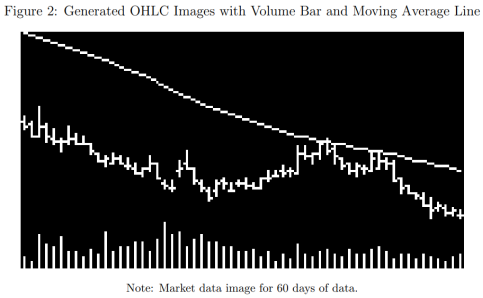
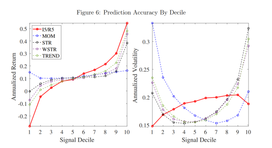
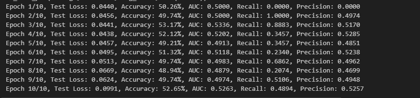
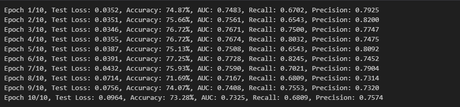
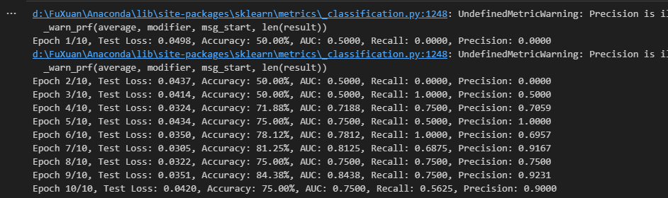
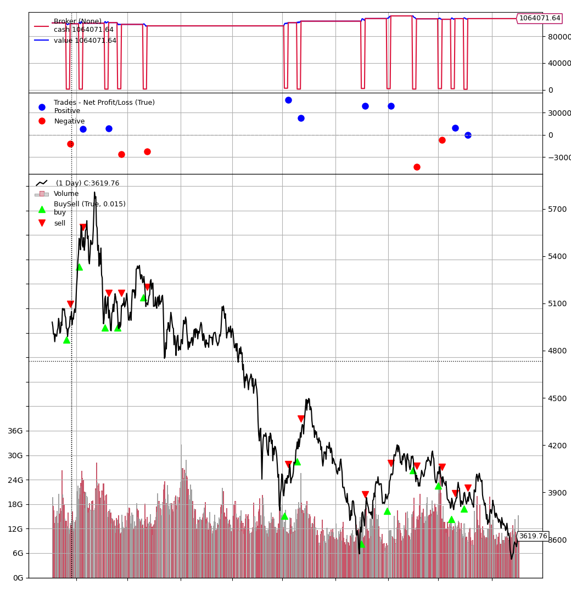
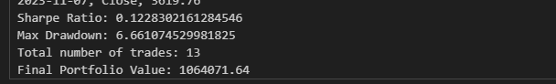

# CNNtoPredictTrend
# 利用CNN来做股票的走势预测，也就是看技术图形来做预测
## 是论文（re-)Imag(in）ing Price Trends的复现
# 分两步，
## 第一步是用来把数据转换为图像
## 第二步是把图像喂给CNN模型里面进行训练和预测
## 具体过程如下
该方法（原始数据为股价的图象）在短时间（日度），长时间（月度），美国市场，全球市场都表现很好。
成功方法一：历史价格图片用cnn。
	图片包括这些信息：open, high, low, and close prices and trading volume，表示为黑白像素值的矩阵。
	Cnn无需手动设计预测特征，它将特征提取过程自动化。CNN在空间上平滑图像内容以减少噪声并强调与未来回报相关的形状配置。
	最终的预测集由原始数字像素值的平滑非线性变换组成。在高层次上，这类似于回归分析中使用的更传统的基于核的数据过滤器。
	将数据变为图象为什么比传统的时间序列更好：1.cnn是用来做图象分析的2.图象更易于模型寻找数据之间的关系属性。3.将量价数据转换为图片利于所有资产进行比较。4.交易员也一直用价格图标作为预测汇报和做投资决策的信息来源。

选用数据：1993到2019的美国股市。
训练一个面板CNN模型来预测未来股票回报的方向(上升或下降)
该模型输入数据是过去5天、20天和60天的价格和交易量(每日开盘价、收盘价、最高价和最低价、每日交易量和移动平均价格)的图像
输出是一组股票水平对短期(5天)、中期(20天)和长期(60天)的后续正回报概率的估计
cnn使用了几个伸缩层的非线性图像变换来生成它的预测
用简单的逻辑回归使用图像背后的价格和数量数据)来最好地近似CNN模型。
通过CNN发现，当一只股票在最近的高-低区间的低端收盘时，未来的回报往往是高的。

将数据转为图象
Ohlc柱：最低、高价格为竖线的最底和最高点，开盘和收盘价为竖线的左右两侧点。一天的这些数据占据3像素。将多天的ohlc柱连接起来。令ohlc中的最大值和最小值分别占据图象的顶部和底部，其他数据相应地进行缩放。Ohlc柱蕴含的日内或一段天数内的波动很难从时间序列中捕捉到。对于ipo和退市的股票直接删掉，但是对于中间有缺失值的股票，不做处理。黑底白字，黑白即可。
移动平均线补充图象：20天的图象就用20天的移动平均线，它占据每天3个像素的中间的像素，然后连起来。
每日交易量条：占据图象底部1/5，最大的量等于给定空间的上限，其它条同样地进行缩放。
下图为最终输入图象的示例。

Cnn实施交叉参数限制，减小了参数化，使易于训练，在相对小的数据集上会有较好的预测。卷积、激活、池化（convolution, activation, and pooling）
训练cnn：

使用8年的样本（1993-2000），其中随机选择70%用于训练，30%用于验证。剩下的19年（2001-2019）作为样本外测试集。
将预测问题转化为分类问题，y=1代表未来收益为正，0为非正。目标为最小化交叉熵损失函数

数据：
	选用1993-2019年的每日股票数据。
	在每张图像将第一天收盘价归一化为1，并根据 
    $$ P_{t+1} = (1+RET_{t+1})*P_t
    $$
  
    构建每个后续的每日收盘价。开盘、最高、最低价也相应地缩放。
	输入的图象有三种周期5、20、60天，分别用来预测未来5、20、60天的涨跌情况，因此共9个模型。

CNN 模型会根据过去的数据预测股票的未来收益率，并依据预测结果将股票分组到不同的投资组合中。这个分组的依据是股票未来收益率的概率，即股票被分成十个等级（decile），每个等级包含一组股票，这些股票未来收益率的概率相同。然后，会构建一个多头和空头的投资组合（H-L 策略）。在这个投资组合中，多头持有预测收益率最高的股票（decile 10），空头持有预测收益率最低的股票（decile 1）。每个投资组合的持有期与模型的预测期一致，也就是说，如果模型是基于 5 天的图像进行预测，那么投资组合的持有期也就是 5 天。
"Ix/Ry" 这个表示法表示模型使用 x 天的图像数据来预测 y 天的持有期收益率。例如，"I5/R5" 表示模型使用 5 天的图像数据来预测 5 天的持有期收益率。
模型对短期的预测可能是最有效的，因此先看5天的
	表中展现了5天数据的平均年化回报率Ret和sharpe比率SR(把股票按照预测的未来回报从低到高排序，然后对每个排名段的股票进行等权重投资。结果显示，这种投资策略能够获得超过 1.8 的夏普比率。接着，作者又介绍了不同时间窗口（5 天、20 天和 60 天）的 CNN 模型的投资表现，多空 H-L 策略的年化夏普比率分别为 7.2、6.8 和 4.9。
为了比较 CNN 模型与其他投资策略的表现，作者还报告了基于 MOM、STR、WSTR 和 TREND 的一周持仓策略的表现，其十分位差的年化夏普比率分别为 0.1、1.8、2.8 和 2.9。
最后，作者提到了一种价值权重投资组合，其中 CNN 策略的夏普比率在 1.4 到 1.7 之间，是价值权重 WSTR 策略的 0.8 夏普比率的两倍。并且，CNN 策略在 H-L 投资组合的长腿和短腿上都优于竞争模型。简单来说，这段文字主要在阐述 CNN 模型在预测股票回报和投资策略优化上的优势。趋势策略，尤其是用于短期策略的，往往具有高周转率。他们计算了策略的平均周转率，并发现在极端情况下，策略的周转率达到了约 30%。总的来说，这篇论文通过详细的分析，证明了 CNN 预测的准确性和稳定性，以及其在金融投资中的应用潜力。)
	基于图像的策略在周转率和夏普比率上都有较好的表现。基于图像的预测策略在短期和长期都有较好的表现，尤其在长期交易中，尽管大部分收益来自第一周，但第一周后仍有相当大的一部分收益实现。基于图像的策略在不同的权重方法和股票规模下都有较好的表现，而且在考虑了交易成本后，其收益仍然显著。

	解释卷积神经网络（CNN）是困难的，因为它们具有递归非线性结构。我们尝试用两种方法解释 CNN 识别出的预测模式。首先，我们将 CNN 拟合到一组在文献中广泛研究的概念相关信号（价格、风险和流动性）。其次，我们研究了基于回归的逻辑逼近方法来解释 CNN。基于图像的预测与文献中的标准特征有很大的关联性，但其独特之处在于其能捕捉到一些非价格特征，并且这些预测与图像的时间跨度有很大关系。
	这些相关性是 CNN 的一项令人印象深刻的成就。它表明，CNN 模型能够从以图像形式抽象表示的数据中辨别出有意义的预测信息。MOM、STR 等常见的价格趋势变化是人类研究人员在数十年的研究过程中手动筛选出的预测特征。但 CNN 对人类工程化特征一无所知；相反，特征工程完全自动化并融入到 CNN 模型本身。在没有手工制作趋势信号的情况下，CNN 仍然能够识别出原始图像中的趋势特征和流动性特征。
	CNN 模型在机器学习应用中的优势之一是，它具有从最少的数据工程中提取预测特征的能力。这与动量和反转文献中的标准方法形成鲜明对比。CNN 模型在图像中检测到的特征可以不需要过多的人工干预

先用2000-2015的000060.SZ行情数据作为7:3的训练和测试集

# 输出结果
在数据没有进行数据的归一化处理，也就是在每张图像将第一天收盘价归一化为1，并根据 
    $$
    P_{t+1} = (1+RET_{t+1})*P_t
    $$

这一步没有做，目前用过去5天来预测未来5天的，只用一支个股的来预测结果，目前结果不理想，没有特别强的预测。

# 接下来要把数据归一化处理
归一化处理之后，看5/5days的预测结果不好，需要测试一下:
1.20/5,训练结果：

效果是不是太好了？？？我需要独立的人帮我检查
是的,因为数据集里面用重复的数据了，因为每隔一天取数据，在分数据集相当于包含了已知答案了。改正的部分包括在做数据的时候，需要用时间作为步骤来分隔。
调整了以后整体预测情况也是比较乐观的。接下来用一个平台来回测一下看看，

# 接下来需要做的事情
## 第一个
接下来需要先把回测框架写下来，然后用一个平台来测试一下，看看预测结果怎么样。
现在在用backtrader这个包来进行本地回测，但是遇到的问题，
1.对整体的回测框架不熟悉，不太懂，到底用什么来进行我的功能实现，需要再学习一下；
2.熟悉之后才能在整体的进行多个股回测。

2023/11/10
正在熟悉用backtrader来回测，现在需要一点点debug一下遇到的这个问题，第一个数据可以显示，在第二个应该是有有判断指标的时候，提示没有datatime这个属性。现在的错误是datetime的格式应该从日期2022/3/23转换到2022-3-23，但是现在报错是。

2023/11/15
backtrader跑通了，今天需要做的是用宽基指数来测试一下从训练到回测的结果。在回测的过程中，需要做2个事情，一个是单边的买入和平常操作；一个是因为看涨信号和看跌信号都会有，所以看涨的时候去做多，看跌的时候去做空，双边交易；补充方面来说，如果加一个止损线，对投资效果会不会有影响？

2023/1/17
现在不加止损线，只利用看图来做沪深300的单边择时买入和平仓的操作，目前的结果如下：

我需要做的事情，是用国债期货的图来做做，因为和固收投资经理的宏观如果做出通向的判断，就可以干。

## 第二个
把已经先的程序写成函数话，然后用主要程序来跑，refactor一下整体框架
## 第三个
需要用多支个股来训练一个模型，然后用多个股来做回测。

# 整体程序的过程
1.生成图，用single_stock_output_pic.py
2.用single_stock_train.py来训练模型
3.在single_stock_train中有预测部分，需要独立出来一部分图形，用于未来预测和回测
4.将预测的结果，在jd/Pred_output中，用于回测，需要将pred_output中的日期改为从日期开始的日期，然后用backtrader回测，在每个日期中给出预测结果。

